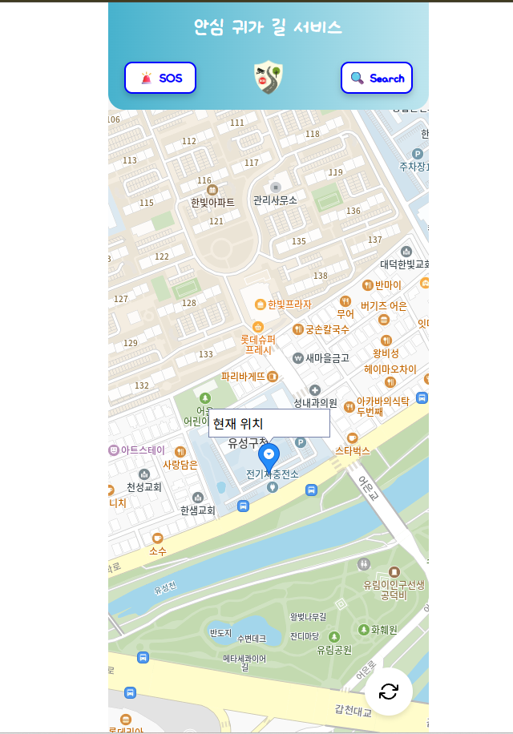
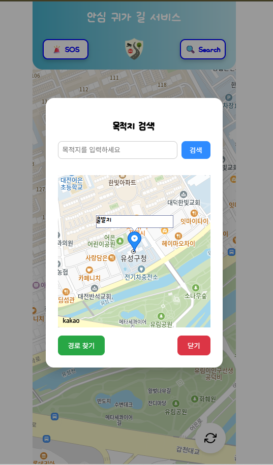
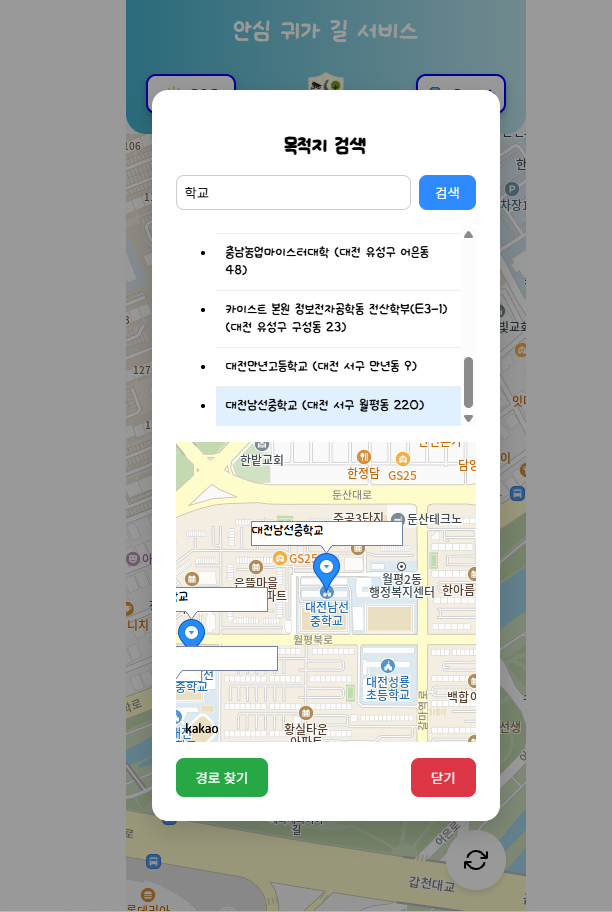
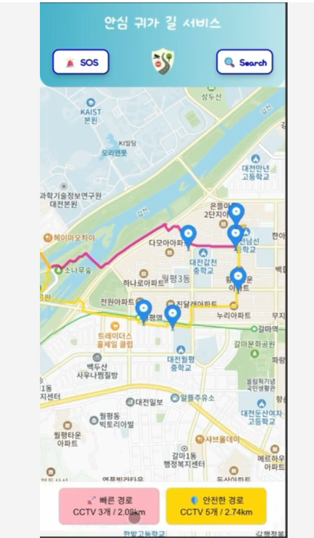
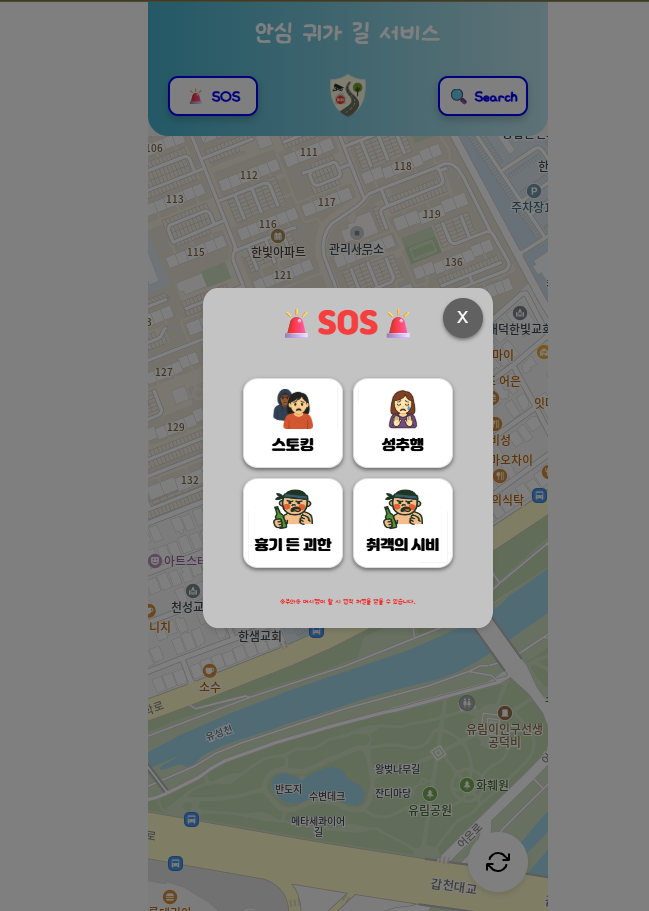
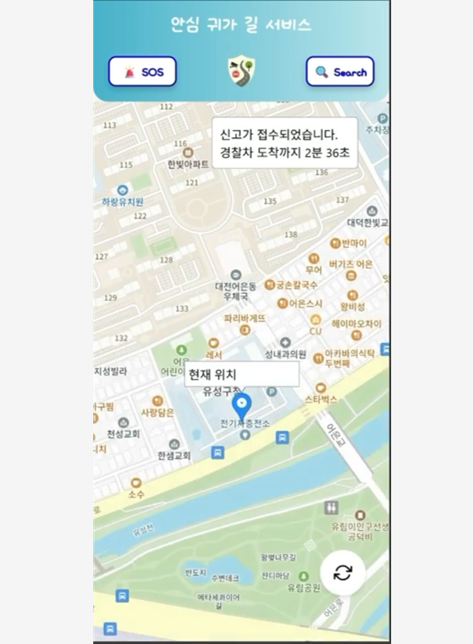

# 🌃 **안심길찾기 Frontend**

> CCTV, 가로등, 위험지역 데이터를 기반으로  
> **더 안전한 귀가 경로**를 안내하는 웹 서비스의 프론트엔드입니다.
 
🌐 배포 주소: https://hackerton-frontend.github.io/FrontEnd/ <br />
🖥️ 백엔드 레포: https://github.com/Hackerton-Frontend/BackEnd

---

## **프로젝트 개요**

| 항목              | 내용                                                              |
| :---------------- | :---------------------------------------------------------------- |
| **프로젝트명**     | 안심길찾기(Safe Path Finder) Frontend                            |
| **목적**           | 사용자가 귀가 시 **일반 경로보다 더 안전한 길을 선택**할 수 있도록 지원 |
| **핵심 기술**      | React 19, Axios, (Kakao Map API), Styled-component, ORS API          |
| **백엔드 통신 방식** | RESTful API ( + 안전 경로 계산 API / ORS 연동 )                   |
| **주요 역할**      | 안전 경로 시각화, CCTV/가로등 기반 안전도 표시, SOS/긴급 기능 제공 |

---

## **주요 기능**

- **안전 경로 탐색** — 최단 거리만이 아니라 **CCTV/가로등/위험지수**를 반영한 안전 경로 제공  
- **지도 기반 UI** — 출발/도착 위치를 지도에서 직관적으로 선택  
- **CCTV 로드뷰 제공** — 사용자는 해당 CCTV의 로드뷰를 확인할 수 있습니다.  
- **경로 비교** — 일반 경로 vs 안전 경로를 한눈에 비교  
- **SOS / 긴급 요청 모달** — 위급 상황 시 빠르게 도움을 요청할 수 있는 UI 및 경찰차 ETA 제공  

---

## **기술 스택**

```txt
Frontend: React (19), Vite
HTTP: Axios
UI: styled-component
Map: Kakao Map, OpenRouteService
Build & Deploy: GitHub Page

```

화면 구성 (UI Screens) <br />
1️⃣ 메인 페이지



> **기능 요약**
> - 서비스 첫 진입 화면
> - 지도 제공
> - 현재 위치 Refresh 기능 제공
> - Header에 목적지 검색 기능과 Two-Touch SOS 요청 기능 제공


2️⃣ 위치 검색 모달


<p align="center">   </p>

> **기능 요약**
> - 목적지를 검색으로 입력할 수 있는 모달 화면
> - 선택된 위치는 지도에 마커로 표시되고, 경로 탐색의 기준점으로 사용


3️⃣ 경로 안내 / 디스플레이 페이지



> **기능 요약**
> - 선택한 출발지/도착지 기준으로 계산된 안전 경로를 지도에 표시
> - 경로 주변 CCTV 위치 시각화
> - CCTV 개수, 거리 표시


4️⃣ CCTV / 안전도 지도 페이지 


> **기능 요약**
> - CCTV 로드뷰 제공

5️⃣ SOS / 긴급 호출 모달

<p align="center">   </p>

> **기능 요약**
> - 위급 상황에서 빠르게 도움을 요청할 수 있는 긴급 기능 UI
> - 상황에 맞는 로고를 클릭하면 사용자의 기본정보와 함께 신고 자동 접수
> - 사용자가 길찾기 도중 위험을 느꼈을 때 바로 2번의 터치로 신고접수 할 수 있는 버튼/모달 형태로 제공

> **요약**
> - 본 프로젝트는 귀가 시 더 안전한 길을 선택할 수 있도록 돕는 안심길찾기 서비스의 UI 레이어입니다.
> - CCTV 공공데이터포털 데이터와 연동하여,
> - 단순한 길찾기를 넘어 사용자의 체감 안전성을 높이는 경로 안내 경험을 제공하는 것을 목표로 합니다.
